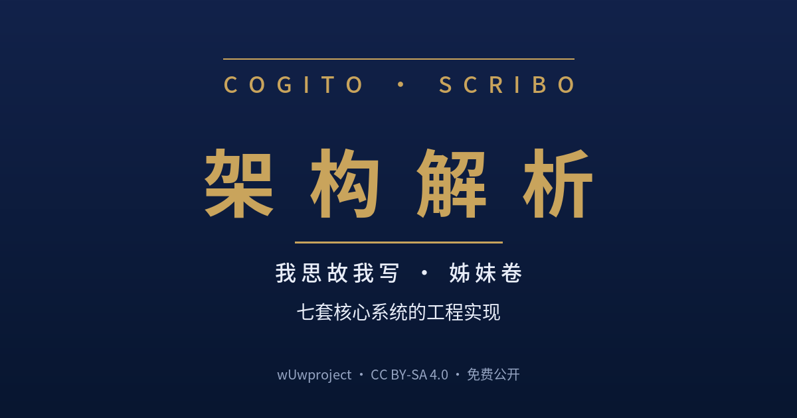

<!--
SPDX-License-Identifier: CC-BY-SA-4.0
Copyright (c) 2026 wUwproject
-->

# Cogito Scribo — 方法论体系

> **Cogito, Scribo.** (我思，故我写。)
>
> wUwproject 重型技能构建过程中沉淀的方法论体系。CC BY-SA 4.0。

## 系列三部曲

| 母书 | 姊妹卷 · 排版 | 姊妹卷 · 架构 |
|------|--------------|--------------|
| <a href="book/README.md"></a> | <a href="typesetting/book/README.md"></a> | <a href="https://gitee.com/wUwproject/architecture/blob/main/book/README.md"></a> |
| **我思故我写**——一本 AI 写成的书 | **排版解析**——五层排版如何把一篇文章变成一本书 | **架构解析**——七套核心系统的工程实现 |
| 回答"为什么" | 回答"怎么排" | 回答"怎么做" |

## 仓库定位

本仓库独立托管 wUwproject 的方法论系列文章（Cogito_Scribit 系列）。2026-08-02 自 `workbuddy-skills` 仓库的 `Cogito_Scribit/` 目录独立拆分而来。

**历史提交说明：** 本仓库为全新初始化，不带历史提交。所有历史记录保留于永久存档仓库：

- Gitee: https://gitee.com/wUwproject/workbuddy-skills （`Cogito_Scribit/` 目录）
- GitHub: https://github.com/Ldxs001/workbuddy-skills （`Cogito_Scribit/` 目录）

## 体系全景

二十一篇文章（十篇主篇 01-10 + 三篇 08 系列扩展 08a/08b/08c + 六篇 09 系列注脚 09a-09f + 两篇 10 系列延伸 10a/10b），一个闭环、一种架构范式：

| 篇 | 主题 | 核心命题 |
|----|------|---------|
| 01 | 硬约束架构 | 多步骤确定性流程中，LLM 的"自觉"是负资产 |
| 02 | 构建时契约 | 构建时用五层契约锁定技能的"正确形态" |
| 03 | 递归自举 | 方法论不约束自己，就没有约束任何东西的资格 |
| 04 | 技能流水线编排 | LLM 从"大脑"降级为"胶水" |
| 05 | 链驱动执行 | 链是主体，LLM 只做两头（前处理+输出整理），中间确定性执行 |
| 06 | 领域智能体 | LLM 承担"查询策略规划者"，组合式检索 |
| 07 | 四条原则元逻辑 | 架构的减法与约束的加法 |
| 08 | 有限决策范式 | LLM 只填空，不决策（三体印证） |
| 08a | 操作层 | 前置规范 > 后置验证；最小尝试次数的分工与监督范式 |
| 08b | 填空的边界 | 空的收束、U型注意力与验证的分工——填空能收到多小（容错宽度 × 注意力窗口双判据，跨 09：预测模型外部考试、空不可收束到点、前置规范防自觉/后置验证防幻觉） |
| 08c | 槽位的减法 | 三种场景的幻觉治理路径与四个论断——槽位本身会不会逼 LLM 编造（槽位是闭集、语义是开集；required=取消拒答权；生成式小模型+规范 JSON 几乎不幻觉；跨 09 全系列：穷举宿命/语义不对等/幻觉累积/误差抵消） |
| 09 | 边界篇 | 穷举的宿命——稳定与随机的悖论（随机误差→被约束的确定性波动） |
| 09a | 检索层注脚 | 探测的边界——RAG 检索鲁棒性的取舍范式（09 的穷举命题在检索层的工程实证） |
| 09b | 推动层注脚 | 配置推动的穷举一致性——统一推动点位与误差的哲学（09 的穷举命题在配置侧的工程实证：统一点位→有限枚举→偏差一致→误差抵消/补正；精密度优先于正确度） |
| 09c | 语义层注脚 | 天然不对等与噪音抑制——语义匹配范式的不对等困境与推理免疫（09 的穷举命题在语义匹配侧的工程实证） |
| 09d | 颗粒度注脚 | 细碎处理与区域重构的成本切割——颗粒度与对齐的悖论（09 的穷举命题在修复粒度侧的工程实证：细碎=确定性特权、重构=成本切割，五确定决策树） |
| 09e | 精度层注脚 | 提示词拉扯的边界——概率曲线的形状工程与定性精度的空耗（09 的穷举命题在精度选型侧的工程实证：提示词是条件概率的条件、softmax 平移不变性决定语气词拉不动分布，精度调优是噪声级拉扯、提示词是结构级拉扯） |
| 09f | 词义层注脚 | 名词不解释就等于没有名词——义项混合的分布与四维展开的锚定（09 的穷举命题在词汇锚定侧的工程实证：名词向量=义项混合中心，单点失重被 softmax 平移不变性清零；解释划界/细化收窄/举例锚定/反例削峰四维展开，语义球→语义锥体；rag-assistant 槽位四件套、semantic-split 触发双清单为实证） |
| 10 | 认知重估 | 判断的让渡与翻译的打通——两种力气活的终结（AI 时代知识价值重估） |
| 10a | 伦理牢笼 | 割圆术的边界——伦理牢笼与 AI 的宿命（做工需要二元论断→边界不可穷尽→画圈=垄断划界权；赫尔辛基宣言为范本） |
| 10b | 语言的天花板 | 语言被抹平——贫瘠的土地上能否开出鲜艳的花？（语言是对观察的压缩，LLM 是对语言的压缩：共情在类型上不可能涌现——语料里没有体验，具身与世界模型也到不了；效率加速器，不是跨时代的革新） |

## 阅读顺序

**01 → 02 → 03 → 04 → 05 → 06 → 07 → 08 → 08a → 08b → 08c → 09 → 09a → 09b → 09c → 09d → 09e → 09f**（09 为边界篇，09a 为 09 的检索层注脚，09b 为 09 的推动层注脚，09c 为 09 的语义层注脚，09d 为 09 的颗粒粒度注脚，09e 为 09 的精度层注脚，09f 为 09 的词义层注脚，依赖关系与定位见 方法论体系总览）；**10 → 10a → 10b 为认知重估篇**（跨全系列的元审视：10 讲让渡与力气活终结，10a 讲让渡之后必须画圈——伦理牢笼，10b 讲让渡之后还剩表达与体验——语言与压缩的天花板。可通读全系列后阅读，也可独立阅读）。注：08b 跨 09（空不可收束到点/前置规范防自觉），08c 跨 09 全系列（槽位是闭集、语义是开集/语义不对等/幻觉累积/误差抵消）——如遇前向引用可先跳读 09 系列后回读

详细阅读指南见 `方法论体系总览.md`。

## 成书：《我思故我写》

本系列文章已汇编为完整一书《**我思故我写——一本 AI 写成的书：AI 时代的方法论、边界与人类自洽**》（约 16.2 万字，35 章，CC BY-SA 4.0）。

**获取与下载（在线阅读 / EPUB / HTML / PDF / 书稿源码 / 构建管线）统一见 [`book/README.md`](book/README.md)。**

书是系列文章的再加工成品：正文为发布版文章，另新增版权页、序言、阅读指南、四部导读、全书结语与附录四件（术语表/工具索引/参考文献/方法论地图）。

## 目录结构

```
Cogito_Scribit/
├── LICENSE                    # CC BY-SA 4.0
├── README.md
├── 方法论体系总览.md           # 系列总纲
├── index.html                 # 成书《我思故我写》入口页（GitHub Pages 首页）
├── book/                      # 成书书稿（四部 + 序言/导读/结语/附录 + 构建管线）
├── typesetting/               # 排版规范 + 排版解析册（导读见 typesetting/README.md）
├── assets/                    # 跨仓库展示用封面
└── 01_~10_*.md                # 方法论文章（含 08a/08b/08c、09a~09f、10a、10b）
```

## 维护约定

- 本仓库由 wUwproject 维护，Gitee / GitHub 双平台同步
- **08 系列容器约定**：智能体协作主题的方法论沉淀统一进入 08 系列（08 + 08a + 08b + 08c + 未来同主题扩展），新增独立方法论维度时另开新篇
- **09 系列容器约定**：穷举宿命与稳定-随机悖论主题的沉淀进入 09 系列（09 + 09a + 09b + 09c + 09d + 09e + 09f + 未来同主题扩展）——09 为边界篇（横跨重型技能 01-07 与智能体协作 08/08a 的元审视），09a 为检索层注脚（RAG is_header 探测实战实证），09b 为推动层注脚（配置推动的穷举一致性实证），09c 为语义层注脚（语义匹配不对等与推理免疫实证），09d 为颗粒度注脚（细碎处理与区域重构的成本切割实证），09e 为精度层注脚（提示词拉扯的边界——概率曲线的形状工程与定性精度的空耗实证），09f 为词义层注脚（名词不解释就等于没有名词——义项混合的分布与四维展开的锚定实证）
- **10 系列容器约定**：认知重估主题的沉淀进入 10 系列（10 + 10a + 10b + 未来同主题扩展）——10 为认知重估篇（判断的让渡与翻译的打通，两种力气活的终结），10a 为伦理牢笼篇（割圆术的边界——让渡之后必须画圈，划界权垄断），10b 为语言的天花板篇（语言被抹平——语言是对观察的压缩、LLM 是对语言的压缩，体验与共情不可压缩）——08 容纳"智能体协作主题"，09 容纳"穷举宿命与稳定-随机悖论主题"，10 系列容纳"认知重估与 AI 宿命主题"
- 文章采用 CC BY-SA 4.0 协议，转载须注明出处
