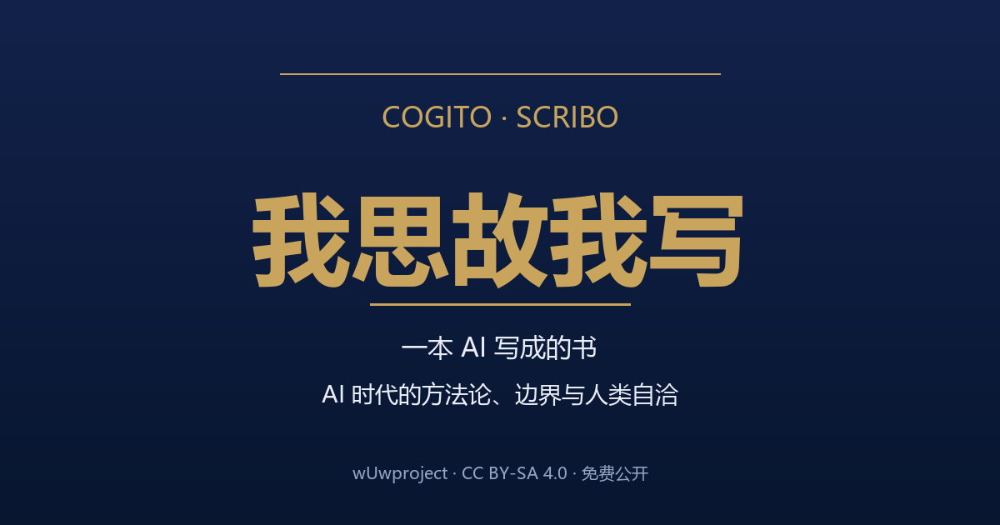

<!--
SPDX-License-Identifier: CC-BY-SA-4.0
Copyright (c) 2026 wUwproject
Licensed under Creative Commons Attribution-ShareAlike 4.0 International (CC BY-SA 4.0).
See https://creativecommons.org/licenses/by-sa/4.0/ for details.
-->

# 我思故我写——一本 AI 写成的书：AI 时代的方法论、边界与人类自洽



> **Cogito, Scribo.** 我思，故我写。
>
> 一本由人与 AI 共同写成的书：从"如何让 LLM 不犯错"的工程方法论，到"让渡之后人还剩什么"的认知重估——一套关于判断、边界与自洽的完整弧线。

> **协议：本书整体采用 CC BY-SA 4.0**（署名-相同方式共享 4.0 国际）。详情见 `frontmatter/00_版权页.md`。

## 获取本书

| 方式 | 入口 |
|------|------|
| **在线阅读整本书** | GitHub Pages：<https://ldxs001.github.io/Cogito_Scribit/>（书入口页 → 在线阅读） |
| **下载 EPUB（电子书）** | `build/output/book.epub`（或独立发行版 **book-v1.1.0**：<https://github.com/Ldxs001/Cogito_Scribit/releases/tag/book-v1.1.0>，Gitee 同 tag） |
| **下载 HTML（网页版）** | `build/output/book.html`（或独立发行版 **book-v1.1.0** 附件） |
| **下载 PDF（打印版）** | 独立发行版 **book-v1.1.0** 附件（思源黑体渲染、A4、每篇独立起页、适合打印阅读） |
| **书稿源码（Markdown）** | 本目录 `book/`（frontmatter + part1~4 + 附录） |

## 书的结构（四部，一本书）

| 部 | 目录 | 收录 | 主题 |
|----|------|------|------|
| 第 I 部 约束 | `part1_约束/` | 01-07 | 如何让 LLM 不犯错（重型技能构建） |
| 第 II 部 协作 | `part2_协作/` | 08、08a、08b、08c | 多个智能体怎么配合（有限决策范式、填空的边界、槽位的减法） |
| 第 III 部 边界 | `part3_边界/` | 09、09a~09e | 这套规则能走多远（穷举的宿命） |
| 第 IV 部 重估 | `part4_重估/` | 10、10a、10b | 让渡之后人还剩什么（认知重估、伦理牢笼与语言的天花板） |

全书约 14.4 万字，37 章（版权页 → 序言 → 阅读指南 → 四部 → 结语 → 附录）。字数口径：汉字+英文单词+数字串（出版折算，中英混杂标准算法）。

## 目录结构

```
book/
├── README.md               # 本书门面（本文件）
├── frontmatter/            # 版权页 / 序言 / 阅读指南
├── part{1-4}_*/            # 四部：导读 + 文章（发布版）
├── 99_结语.md              # 全书收束
├── appendix/               # 术语表 / 工具索引 / 参考文献 / 方法论地图
└── build/
    ├── *.py                # 构建管线（assemble / md2html / build_epub，零依赖）
    └── output/             # 全书.md / book.html / book.epub（发布入口命名）
```

## 与源系列的关系（溯源）

- 本书正文来自本仓库的方法论系列（根目录 01_~10b_*.md），CC BY-SA 4.0
- 源仓库双平台同步，内容一致，任选其一：
  - Gitee：<https://gitee.com/wUwproject/Cogito_Scribit>
  - GitHub：<https://github.com/Ldxs001/Cogito_Scribit>
- **说明**：`book/` 内文章为**发布版**（去除工具特指表述），与根目录原文略有差异；根目录保持源文原样。书的序言、导读、结语、附录为本书新增，源仓库不含。
- 本书构建产物由 `build/build.py` 一键生成（MD → HTML/EPUB，纯标准库零依赖）。
