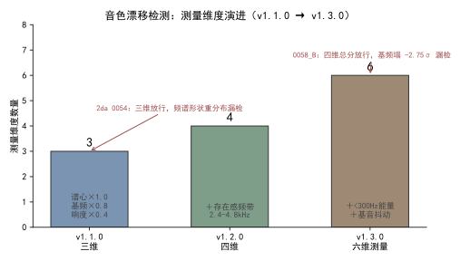
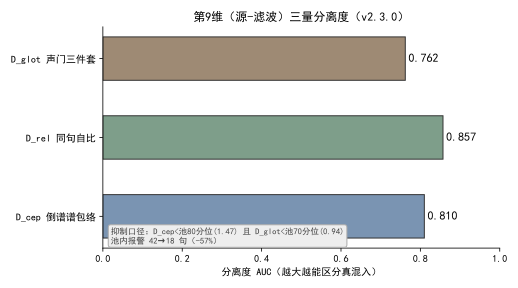

<!--
SPDX-License-Identifier: CC-BY-SA-4.0
Copyright (c) 2026 wUwproject
Licensed under Creative Commons Attribution-ShareAlike 4.0 International (CC BY-SA 4.0).
See https://creativecommons.org/licenses/by-sa/4.0/ for details.
-->

# 第三部 · 14｜音色漂移检测：从三维合验到五族合验

> 摘要：克隆音色逐句抽样会生出漂移句——个别句子音色同时偏暗、偏低、偏轻，听感近似「换了个人」。早期三维加权分把多维偏移摊薄、对频谱形状结构性失明，连续放行了人耳判坏的候选。本文只讲这一个矛盾的演进：检测怎么从「三维加权分」长成「五族合验」，以及源-滤波模型怎么让第 9 维对基频免疫。边界声明：本文覆盖 v1.1.0→v1.7.2 的合验演进、第 9 维（源-滤波）原理，以及 v2.10.0 把标尺 / 试听 / 标定收同源的收束；第 9 维的深拆留给同书 #19。

## 一、引子：真实起点

克隆音色靠一条参考音频加文本，确定性地派生种子做逐句抽样。问题在 v1.1.0 之前就存在：个别句子音色会悄悄漂移，而系统里没有一个判定者——漂移句直接进入成片 [1]。

实测 2c 期 253 句中，有 4 句（0093 / 0101 / 0135 / 0157）达到「近换人」的程度，既有 `looks_degenerate` 只判时长失控，音色维度没有任何检测 [1]。一句原角色的声音，被一两句「变了个嗓」的句子混在成片里，听者能听出不对，程序却指不出来。

## 二、现象：它到底长什么样

把早期三维体检的放行记录拉出来看，放行了人耳判坏的候选——这是故障的表象。

2da 期 0054 句，三维分只有 2.76，远低于阈值 4.25，本应被放过。分频带剖面却显示：300–600 Hz 抬升、600–2400 Hz 掏空、2.4–4.8 kHz 存在感频带 +4.6σ（全期 102 句 B 中唯一过 +3σ）——频谱形状整体重分布，而谱心是加权平均位置，对形状搬移结构性失明 [2]。

更隐蔽的在四维验收下仍漏：第 3 期 0058_B 四维 3.94 < 4.25 判「已修复」，人耳复核却仍不是原角色——总分下降全部来自谱心与存在感变贴，基频反而从 213 Hz 塌到 208.5 Hz（−2.75σ）[3]。判分说「好了」，耳朵说「不是他」。

## 三、错误尝试：我们怎么绕弯的

绕弯有过一条路：用一把加权总分兜住所有偏移。把谱心、基频、响度各量一个 z 值，按权重求和成一个分，超阈值就点名——指望这个分能同时捕捉所有方向的漂移 [1]。

这条路的盲区很快暴露。坏样本属于两个**交互族**：其一「基频下偏 × 基音抖动升高」（低音且不稳，病态嗓），其二「基频下偏 × 低频饱满」（单薄变饱满，音色身份漂移）[3]。加权总分把多维偏移摊薄，两个维度的联合偏移被其余贴合维度稀释后低于阈值；而既有维度全是单维统计量，根本不度量维度之间的关系 [3]。曾有人提过「单维上限」方案，覆盖的案例后来全部由身份下限接管，于是删除 [3]。

> **加权分**：把若干维度的 z 归一值按权重求和成一个总分，超阈值即点名。它是合验的第一代武器，也是本文要拆解的对象。
> **基线**：按角色各自建立的均值与标准差，z 归一用的标尺——不同角色各算各的，不混算。

## 四、根因：为什么

根因一句话：合验的第一代武器（加权总分）是单维统计量的线性组合，对两类盲区束手无策——**维度间交互**与**频谱形状重分布**。

谱心是加权平均位置，形状搬移时位置未必大动（2da 0054 即是）；加权求和又把联合偏移稀释（0058_B 即是）。两个盲区同源：检测器量的是「每个维度的位置」，不是「维度之间的关係」与「形状的整体搬移」。只要检测器还停在「逐维看位置」，它就接不住人耳听的「整段声音是不是同一个人」。

## 五、正确修法：怎么做对的

修复口径不是「再加一个维度」，而是把合验的武器从「逐维位置」换到「关系、形状、声源/声道分离」三层。演进四步，每一步都对应前面漏掉的一类盲区。

### 5.1 维度扩展的时间线

```text
v1.1.0  三维：谱心×1.0 + 基频×0.8 + 响度×0.4        → 加权分 ≥ 4.25 点名
v1.2.0  四维：+ 存在感频带 2.4–4.8kHz 单边加权         → 补频谱形状盲区
v1.3.0  六维测量 + 三判据合验：+ <300Hz能量 + 抖动；暗淡子分 / 身份下限
v1.7.2  五族换芯：旧四维分(谱心单项截断) + 缺亮音 + 低频双向 + 声纹嵌入 + 音高偏移EMA
                                                  （另：女声源-滤波声门三件套原样保留）
```

  
*图 1：测量维度数从三维长到六维，每一次扩展都对应一次漏检事故。红标＝加权分放行、人耳判坏的候选（2da 0054 / 0058_B）。数据源 [1][2][3]。*

### 5.2 三步扩展各自补的盲区

- **v1.2.0 四维**：`_timbre_features` 新增存在感频带（原始采样率上整段加 hanning 窗，取功率谱 2.4–4.8 kHz 能量占比；必须在降采样之前量，降到 16k 后 Nyquist 不足，带内形状会变）。`_timbre_score` 追加 `0.5 × max(0, z存在感)` 单边加权——占比偏低属音色自然差异不点名，只计刺耳方向 [2]。
- **v1.3.0 六维测量 + 三判据合验**：测量再扩 `<300 Hz` 能量占比与基音抖动 jitter；新增**暗淡子分** `max(0, z基频下偏) + max(0, z谱心变暗) + 0.6 × max(0, z抖动)`（阈值 4.9），专抓「基频下偏 × 抖动升高」病态嗓；新增**身份下限**（基频 ≤ −2.4σ，或基频 ≤ −2.0σ 且 <300 Hz 占比 ≥ +1.5σ），专抓「基频下偏 × 低频饱满」身份漂移族 [3]。三判据任一命中即点名，**候选验收与检测共用同一把尺**——重出候选必须三项全过才转正 [3]。
- **v1.7.2 五族换芯**：`_timbre_capture` 把判据扩成五族合验（见下表），并把谱心项改成 `max(0,·)` 单向截断，让「亮漂」不再抵消音高偏离 [4]。

| 族 | 量 | 口径 / 阈值 |
|---|---|---|
| ① 旧四维分 | 谱心×1.0 + 基频×0.8 + 响度×0.4 + 存在感单边 | 加权分 ≥ 4.25（谱心项改单向截断） |
| ② 缺亮音 | 谱心暗漂 | `tts.timbre_cent_dark`=1.5，单向 |
| ③ 低频双向 | `<300 Hz` 能量占比偏移 | `tts.s300_band`=1.5，双向 |
| ④ 声纹嵌入 | wavlm 余弦相似度 | `tts.sv_guard`=True，`sim < tts.sv_sim`=0.90 点名，时长门 `tts.sv_min_seconds`=4.0 s |
| ⑤ 音高偏移 | 每期 o EMA | 冷启动取前 10 合格句中位、更新门 1.5 半音、硬钳位 ±2.5 半音 |

*表 1：五族合验家族（v1.7.2）。女声三件套（声门，源-滤波）原样保留，不计入五族编号 [4][6]。*

### 5.3 第 9 维：用源-滤波模型把声源与声道分开

前五族仍在「逐维位置」层面工作。真正把声源与声道切开的是第 9 维（v2.3.0），它用**源-滤波模型**让检测对基频免疫。

> **源-滤波模型（Fant 1960）**：语音 = 声源（声门）激励 × 声道（滤波）响应。时域 `s = e * h`（卷积）→ 频域 `S(f) = E(f) · H(f)`（相乘）→ 取对数 `log|S| = log|E| + log|H|`。`log|H|` 是慢变的谱包络 = 声道形状 = 音色；`log|E|` 是快变的谐波梳 = 基频 = 音高。取对数把相乘变相加，再对 log 谱做低通 liftering（倒谱）分离两者：低 quefrency = 声道包络（几乎不随音高变），高 quefrency = 基频周期（quefrency 上 1/F0 处峰）[5]。

第 9 维三量都建立在这个分离之上（`podcast_maker/seg_incursion.py`）：

| # | 量 | 算法 | 对 F0 免疫机制 |
|---|---|---|---|
| ① `D_cep` 倒谱谱包络 | 帧平均幅度谱→`log10`→`irfft` 取倒谱→只留 quefrency<2 ms→`rfft` 回谱包络→13 个对数频点采样→逐点减自身均值（去增益与倾斜，只留共振峰形状）→与角色池逐系数 σ 归一求 RMS | `1/F0` 在 70~500 Hz 对应 2~14 ms，全被 lifter 切门外；形状量不含 F0 |
| ② `D_rel` 同句自比 | 被点名段包络 vs 同一句其它段中位包络（池 σ 归一） | 同上；另消句级通道/语速差异 |
| ③ `D_glot` 声门三件套 | 逐有声帧 CPP + HNR + H1\*–H2\* → 段内中位 → 角色池 μ/σ 归一 | 量的是声源，不是声道也不是音高 |

*表 2：第 9 维三量算法与对 F0 免疫机制（v2.3.0）[5]。*

三个量的公式口径：CPP = 倒谱峰相对回归线高度（Hillenbrand 1994）；`HNR = 10·log10(r/(1−r))` 归一化自相关峰（de Krom 1993 / Praat 口径）；`H1*–H2*` = F0、2F0 处幅度差再减掉倒谱包络在两点的落差（去声道影响）[6]。

```math
S(f) = E(f) · H(f)  →  log|S| = log|E| + log|H|  →  lifter(低quefrency) 分离声道/声源
```

真实签名（两个独立来源件同套）：CPP 0.56/0.62（池 0.28）、HNR 9.08/8.91（池 5.17）、H1\*–H2\* −4.32/−8.58（池 +1.06）→ 真混入；同人喊高三个量全贴池均值（抬音高不改声门开商）[6]。

  
*图 2：D_cep / D_rel / D_glot 的分离度 AUC，越大越能区分真混入；抑制口径 `D_cep < 池80分位(1.47) 且 D_glot < 池70分位(0.94)`，池内报警 42→18 句（−57%）。数据源 [6]。*

### 5.4 标尺、试听与标定的同源收束（v2.10.0）

第五族合验守的是「声音是不是同一个人」，但它依赖的标尺、试听与标定三件套本身也有同源问题——v2.10.0 把它们一并收束。

**现象**：① 全局唯一标尺 `previews/standard.wav` 文本与载体都取自首次生成的 A 角，A / B 试听只是同段音频快慢不同，听到的不是本人嗓子 [7]；② 试听分母用整段口径（`k = 有效字 ÷ 含句间停顿的整段时长`），而 `k_role` 是逐句口径（不含停顿），两端口径不一致，试听词速系统性偏快 **7.87%** [8]；③ 原标定参考取 `voice_profiles` 合成对、文本固定三句，与成片用的 `ref_base` 不是同一条嗓子，标定的语速对不上成片 [9]。

**根因**：标尺 / 试听 / 标定三处各自一套「参考与口径」，没有强制同源——标尺全局唯一不随角色走、试听分母与标定分母口径不一致、标定参考与成片参考分两套。三者任一不同源，人耳能听出的偏差就从这里漏 [7][8][9]。

**修法**（三项）：

- **标尺 A / B 分离**：`tts_engine.ruler_files`（:2174）按角色定文件名（`standard_A.wav` / `standard_B.wav` 及各自 json），`read_ruler`（:2270）/`standard_ruler`（:2305）增 `role` 参数、落盘 json 增 `role`；`_sentence_boundary_fracs`（:2215）由写死的三句占比改为按**传入文本**算；`web_ui._std_ruler_text`（:1028）读该角色 `ref.txt`、读不到退回标定文本兜底 [7]。旧 `previews/standard.wav` 保留在盘、代码不再引用。
- **句口径 k_sentence + 试听按角色分管**：`standard_ruler` 落盘增列 `k_sentence`（句子口径，构建时从刚写出的音频量得；旧尺子缺列时只读现量一次，量不出退回整段口径）；`api_preview_standard`（:1074）分母改用 `k_sentence`，`_get_std_ruler`（:1050）/`standard_payload`（:73）的 `k_sentence` 由单值改为 `{"A": …，"B": …}`，前端 `ratioNote` 按点位角色取对应分母——A / B 两条尺子文本与句间停顿各异，「整段 → 句口径」系数随之不同（实测旧尺 ×1.079、新 A ×1.112、新 B ×1.183），分母只能逐条实量 [8]。
- **标定改以 ref_base 为参考**：`tts_engine.voice_entity_ref`（:974）定位音色本体、`ensure_calib_ref`（:1049）缓存命中即用、缺则现场生成，落点 `<repo>/calib_refs/<角色>/<本体指纹前16>/`；标定参考取该角色 `base_wav`（`ref_base_<sign>.wav`）本尊、转录取单份 `ref.txt` 逐句合成；`api_voice_calibrate`（:1169）本地引擎分支、标定合成前先腾显存（见 #13）；`make_base_ref._gen_baseref`（:210）抽出候选挑选唯一实现，项目链（`build_role` :250）与标定链（`build_from` :343）共用，命令行 `--from-wav` / `--from-text` / `--out-dir` 脱离 `--project-dir` [9]。

## 六、验证：数据说话

四组证据，测量条件一并给出。

**耳标样本三判据合验 15/15**（v1.3.0）[3]：坏区 9 句全部命中——四维总分抓 3 句、暗淡子分抓 4 句、身份下限抓 3 句；放行区 6 句全部放过。这就是「从逐维位置换到关系/形状」后，人耳能听出的漂移终于被接住。

**第 3 期全体 B 角以三判据重判（只读，未动音频）**[3]：点名 0014_B（四维 4.18 + 暗淡 4.19 双放行，身份下偏 +2.53σ 抓获）与 0058_B（旧四维 3.93 放行，身份下偏 +2.75σ 抓获）；其余 135 句含旧修复 0205_B 全部放行，无误报。

**第 9 维分离度**（v2.3.0）[6]：D_cep AUC 0.810、D_rel 0.857、D_glot 0.762；抑制口径下池内报警 **42→18 句（−57%）**。顺带两件：第 8 维线定错（固定线 3.2≈中位数→报警 53%；改池 90 分位 z=5.73/4.27→报警 7%）；倍频嫌疑证伪（改用谐波梳命中率，`hit(f0/2)` 中位 0.50，≥0.83 段 0/74→真基频非倍频）。

**单测计数**：全量 v1.1.0 **1294** → v1.2.0 **1298** → v1.3.0 **1311** → v1.7.2 **1391**（判据换芯前 1359）[1][2][3][4]。第 9 维新增 `tests/test_timbre_guard.py::SegIncursionVetoTest`（8 条：两道否决零误伤钉、否决压不掉真混入的守卫、`flag()` veto 关键字兼容、calibrate 句数门）与 `SegIncursionDimsTest`（合成 150 Hz 谐波 wav 钉段级行结构与 f0 读数）[6]。

**标尺 / 试听 / 标定同源（v2.10.0）**：

- `tests/test_preview_standard.py::TestStandardPayload`（:301）4 条：尺子在场时 `k` 与 `k_sentence` 一并下发且不等、旧尺子缺列如实退回整段口径、尺子不在场不含 `k_sentence`、读尺子抛异常降级只报 `k` [8]。
- `tests/test_preview_standard.py::TestRulerCarrierPinned`（:494）2 条：构建路径烙设备与后端、只读路径不探测服务 [7]。
- `tests/test_preview_standard.py` 另增 5 条：A / B 两尺子各占文件名、写入互不覆盖、只读各取自己那条、文本随角色落到各自 json、`_sentence_boundary_fracs` 按传入文本算 [7]。
- `tests/test_tts_engine.py::TestVoiceEntityRef`（:832）4 条、`TestCalibRef`（:867）4 条；`TestScriptPins` 增 2 条（`ref_base` 候选挑选唯一实现、命令行留出脱离项目那一路）[9]。
- 尺子 A / B 分离与标定改参考后复跑全量 **1601** 通过（skipped=1）；标定脱离项目后全量 **1612** 通过（skipped=1）[7][9]。

## 七、结语：一句话可复用结论

音色漂移检测不是「多加维度」，而是把合验的武器从「每个维度的位置」换成「维度之间的关系、形状的整体搬移、以及声源与声道的分离」。维度从三维长到五族合验，第 9 维再切开源-滤波——合验才接住了人耳能听出的漂移。

v2.10.0 把守着「声音是不是同一个人」的标尺、试听与标定三件套也收了同源——标尺按角色各念各的 `ref.txt`、试听分母逐条实量到句口径、标定直接以 `ref_base` 本尊为参考，让「检测的同源性」从合验判据一路贯穿到测量与标定的源头。

### 引用与出处说明

| 编号 | 引用 | 出处 |
|------|------|------|
| [1] | v1.1.0 新增音色体检：逐句基频中位/谱心/响度三维；加权分 谱心×1.0+基频×0.8+响度×0.4 ≥4.25；六句人耳定标（0157=6.17/0093=5.15/0135=4.68/0101=4.32 报警，0169=4.20/0233=3.88 放过）；2c 期 253 句 4 句点名；全量 1294 项 | podcast-maker · CHANGELOG.md · v1.1.0 · 条目「新增音色体检（timbre guard）」<br>`podcast_maker/tts_engine.py:_timbre_features`(`:1199`)/`_timbre_score`(`:1291`) |
| [2] | v1.2.0 四维：+ 存在感频带 2.4–4.8kHz（降采样前量）；`_timbre_score` 追加 0.5×max(0,z存在感) 单边；2da 0054 三维放行漏检；全量 1298 项 | podcast-maker · CHANGELOG.md · v1.2.0 · 条目「判定分由三维扩为四维」 |
| [3] | v1.3.0 六维测量（+<300Hz能量 +jitter）+ 三判据合验（暗淡子分≥4.9 / 身份下限）；四维验收放行人耳判坏 0058_B（基频塌 -2.75σ）；15 耳标 15/15；第3期 B 角重判抓获 0014_B/0058_B；全量 1311 项 | podcast-maker · CHANGELOG.md · v1.3.0 · 条目「三判据合验」<br>`podcast_maker/tts_engine.py:_timbre_score`(`:1291`) |
| [4] | v1.7.2 五族合验换芯（旧四维分谱心截断 / 缺亮音 / 低频双向 / 声纹嵌入 / 音高偏移EMA）；女声三件套原样保留；候选验收 fail-closed；全量 1391 项 | podcast-maker · CHANGELOG.md · v1.7.2 · 条目「音色体检判据换芯（五族合验）」<br>`podcast_maker/tts_engine.py:_timbre_capture` |
| [5] | 源-滤波模型（Fant 1960）：`S(f)=E(f)·H(f)`→`log\|S\|=log\|E\|+log\|H\|`，低通 liftering 分离声道包络/基频周期；第9维 D_cep/D_rel/D_glot 算法与对 F0 免疫机制（1/F0 在 2~14ms 全被切门外） | podcast-maker · CHANGELOG.md · v2.3.0 · 第9维条目<br>`podcast_maker/seg_incursion.py`（项目实证，原理 L1 文献） |
| [6] | 三量公式口径（CPP/HNR/H1\*–H2\*）；真实签名（CPP 0.56/0.62、HNR 9.08/8.91、H1\*–H2\* -4.32/-8.58）；分离度 AUC（D_cep 0.810/D_rel 0.857/D_glot 0.762）；抑制口径 D_cep<1.47 且 D_glot<0.94，报警 42→18 句(-57%)；第8维线定错 53%→7%；倍频证伪 | podcast-maker · CHANGELOG.md · v2.3.0 · 第9维条目（实测 L1 代码）<br>`podcast_maker/seg_incursion.py:calibrate`(`:667`)；`tests/test_timbre_guard.py::SegIncursionVetoTest` |

| [7] | v2.10.0 标准尺子 A/B 分离：ruler_files 按角色定名、read_ruler/standard_ruler 增 role；_sentence_boundary_fracs 按传入文本算；_std_ruler_text 读角色 ref.txt；旧 standard.wav 保留不引用；全量 1601 通过 | podcast-maker · CHANGELOG.md · v2.10.0 · 条目「标准尺子 A / B 分离，各念各自 ref.txt」<br>`podcast_maker/tts_engine.py:ruler_files`(:2174)/`read_ruler`(:2270)/`standard_ruler`(:2305) |
| [8] | v2.10.0 试听分母口径对齐：k_sentence 句子口径落盘、api_preview_standard 分母改用 k_sentence、standard_payload 按角色下发；旧口径偏快 7.87%；全量 1565 / 1601 | podcast-maker · CHANGELOG.md · v2.10.0 · 条目「试听分母口径与分子不对齐，词速系统性偏快 7.87%」<br>`podcast_maker/tts_engine.py:standard_ruler`(:2305)；`podcast_maker/web_ui.py:api_preview_standard`(:1074) |
| [9] | v2.10.0 标定改以 ref_base 为参考：voice_entity_ref/ensure_calib_ref 本体定位 + 缓存；api_voice_calibrate 取 base_wav 本尊 + ref.txt 逐句；_gen_baseref 候选挑选唯一实现、build_from 脱离项目；全量 1612 通过 | podcast-maker · CHANGELOG.md · v2.10.0 · 条目「标定改以 ref_base 为参考、念角色自己的 ref.txt」「ref_base 的候选挑选收敛为唯一实现」「标定脱离项目」<br>`podcast_maker/tts_engine.py:voice_entity_ref`(:974)/`ensure_calib_ref`(:1049)；`tts_service/make_base_ref.py:_gen_baseref`(:210) |

## 延伸阅读

- **同书 #19《声门三件套与傅里叶域分段》**：本文第 9 维只讲原理与对 F0 免疫机制；第 9 维的段级否决接线、第 8 维线定错、倍频证伪的完整拆机在 #19。
- **同书 #13《本地 TTS 显存管理》**：声纹嵌入引擎（`SVEngine`，v1.7.2 第④族）的显存门槛与 Job 对象绑定纪律，与本文第④族判据共用同一套本地语音服务纪律。

---

*最后更新：2026-10-10（已带图：图1 维度演进 + 图2 第9维 AUC；含五族合验表 + 第9维三量表 + 源-滤波公式块 + 5.4 标尺/试听/标定同源收束；四检：真实性 PASS / 底层逻辑 PASS / 空推论 PASS / 循环论证 PASS）*
