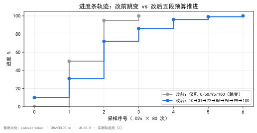

<!--
SPDX-License-Identifier: CC-BY-SA-4.0
Copyright (c) 2026 wUwproject
Licensed under Creative Commons Attribution-ShareAlike 4.0 International (CC BY-SA 4.0).
See https://creativecommons.org/licenses/by-sa/4.0/ for details.
-->

# 第六部 · 28｜一个进度条为什么永远卡在 0% 和 100%？

> 摘要：脚本生成页那条进度条不是坏了，是从没接上写稿段——预算表只覆盖收尾两格，整趟最耗时的写稿段一格都没有。本文只讲这一个矛盾：进度条是预算表的可视化，预算漏一段，界面就永远看不到那一段。

## 一、引子：真实起点

某次长活跑批，用户在脚本生成页按下「生成脚本」，然后去倒了杯水。回来时进度条还停在 0%；再一眨眼，直接跳到 100%，成品已经躺在产物区。

那趟任务实跑二十分钟到半小时——本地模型写稿本就慢。可界面上能看见的，只有「没动」和「好了」两个状态。中间发生了什么，进度条一个字都说不出。

这不是偶发卡顿。换任何一期、任何长度，轨迹都长一样：开头死寂，结尾瞬跳。

## 二、现象：它到底长什么样

把前端轮询记录拉出来看，实测轨迹只有四跳：

```text
改前：  0%  ·····································  100%
```

更精确地说，CHANGELOG 记录的真实采样是 `0% → 50% → 95% → 100%` 四跳，而且全部挤在任务最后几十秒里 [1]。

问题出在轮询粒度。前端每 1.5 秒问一次进度。50% 与 95% 这两跳往往发生在几百毫秒内——一次轮询都未必能抓到，下一只看到 100%。于是用户视角里，进度条等于只有 0% 和 100% 两个可见态。

对比改后的轨迹，主体是能看见刻度的：

```text
改后：  10% → 31% → 72% → 86% → 96% → 99% → 100%
```

分段路（一期六段写作）的完整轨迹更细：`1% → 4.5% → … → 72.0% → 86.0% → … → 99.0%`，**前进 17 次、倒回 0 次** [2]。真实运行时每一格之间隔着几分钟，肉眼看得清清楚楚。

## 三、错误尝试：我们怎么绕弯的

绕弯有两条路，都试过、都错。

**第一条：用非里程碑行稀释刻度。** 直觉是「进度条不动是因为我推得不够勤」，于是把「目标：1500 秒 / 约 6024 字」这类行也拿来推一把。结果刻度被稀释成噪声——一句话推一格，进度的物理意义没了，反倒让人误以为快好了 [3]。这是把显示当成了需要填充的条，而不是预算的真实投影。

**第二条：测试只覆盖了错的那半边。** 旧版 `tests/test_batch.py::test_stage_and_progress_follow_the_round` 只验了「检查段、门禁段按轮前进」[4]。写稿段该不该动进度，一个断言都没有。于是折算规则漏掉一整段，测试照样全绿——**测的是已经对的半边，漏的是从来没接上的半边**。这条错路最危险：它让 bug 在持续集成里隐身。

## 四、根因：为什么

根因是两层叠加，不是一处笔误。

**第一层：写稿段根本没有预算。** `_script_stage` 的折算规则只认「检查第 N 轮」「门禁第 N 轮」，它们分掉全部 100%（检查 0~50%、门禁 50~100%）。写稿段那两行——分段路的「段 k/N 完成」、整篇路的「生成第 N 次」——被一条分支整个吞掉，没有人认这个前缀，一行都不折算 [1]。而写稿恰恰是本地模型跑十几分钟到半小时的那一段，最该有刻度。

**第二层：收尾两段挤在同一毫秒。** 形式门禁是纯代码判定、不调模型，「检查通过 → 门禁通过 → 收尾」瞬时连发，进度条上那两跳被压缩到几毫秒里，注定看不见 [1]。

两层叠起来：该有刻度的中段没有，仅有的两跳又挤在结尾瞬间。于是「永远 0% 和 100%」。

> **账本**：本文指进度/预算的确定性记录。进度条不是独立显示组件，而是这张账本的可视化——账本漏一段，界面就少一段。
> **门禁**：提交/发布前的自动检查，不过即阻断。此处指脚本生成的形式门禁（纯代码判定，不调模型）。

## 五、正确修法：怎么做对的

把预算表重做成五段，让主体拿到刻度。

**`_BANDS` 一张表写完全部区间** [5]。值域用 `[起, 止)` 且**首尾相接**——进了下一段就天然比上一段任何一格都大，所以进度只前进不后退，不必每处再比一次 `max`。把刻度集中成表而非散在分支里，是为了让「哪一段有刻度、哪一段没有」一眼可见：从前散着写，漏掉一整段也看不出来。

五段划分：

| 段 | 区间 | 刻度来源 |
|---|---|---|
| 准备 | 0.00 ~ 0.10 | 逻辑拆分 / 装箱 / 规划，一行一格 |
| **写稿** | **0.10 ~ 0.72** | 分段路「段 k/N 完成」；整篇路「输出坏了重发」的轮 |
| 检查 | 0.72 ~ 0.86 | 「检查第 N 轮」，按轮 |
| 门禁 | 0.86 ~ 0.96 | 「门禁第 N 轮」，按轮 |
| 收尾 | 0.96 ~ 0.99 | 粘回顾 / 粘片头尾 |

```text
# _BANDS：五段预算，[起,止) 首尾相接，查表而非散写
BANDS = [
    ("准备", 0.00, 0.10),
    ("写稿", 0.10, 0.72),
    ("检查", 0.72, 0.86),
    ("门禁", 0.86, 0.96),
    ("收尾", 0.96, 0.99),
]

def progress_for(stage, done, total):
    lo, hi = band_range(stage)          # 查表，不各写一个数
    frac = done / total if total else 0
    return lo + (hi - lo) * frac          # 进下一段天然 > 上一段任意值

# 单调性保证：因 [起,止) 首尾相接，无需每处 max()
assert BANDS[i][2] == BANDS[i + 1][1]    # 段与段相接 [5]
```

**写稿段的分母用这一路天然就有的计数，不另传参数。** 分段路的日志行「段 k/N 完成」里**本来就带着 N**，按 `k/N` 折；整篇路一次出一整篇，按「输出坏了重发」的轮次折。轮次表只有一份实现 `script_engine._segment_parse_rounds`，两处共用，不各写一个数——否则改了一处另一处静默错位 [5]。

**只在里程碑行推进度。** 不是里程碑的行不动进度、也不改阶段。让无关行推一把等于把刻度稀释成噪声（见第三节第一条错路）。

**不画假进度。** 一轮跑多久本来没人知道，匀速前进的假条只会让人以为快好了。「调用模型…」那几行只把进度摆到本格起点并更新阶段——用途是让界面在漫长一轮里说得出在干什么，而不是停在上一句话上 [3]。

修复口径收得很窄：`script_engine` 一行未动，日志行一字未改——界面按既有段名折算这件事本来就这样设计，缺的只是表没写全 [6]。

## 六、验证：数据说话

四组证据，测量条件一并给出。

**轨迹对比**（假模型走真实任务通路，`.02` 秒采样 80 次）[2]：改前 `0% … 100%`，改后 `10% → 31% → 72% → 86% → 96% → 99% → 100%`。

  
*图 1：进度条轨迹前后对比。数据源 [2]（`podcast-maker · CHANGELOG.md · v0.45.0 · 实测轨迹段`）。改前仅见 0/50/95/100 四个跳变点；改后五段预算把它摊成 10/31/72/86/96/99/100，采样序列全程单调推进。*

### 实验设计：假模型走真实通路的轨迹测量

**目的**：在真实任务通路上测出改前/改后的进度轨迹，排除真实模型耗时抖动对采样的干扰。

**输入**：假模型（不调真实 LLM，按固定节奏吐字），走与真实生成完全相同的 `script_engine` 通路。

**步骤**：`.02` 秒采样、共 80 次，记录每次轮询拿到的进度值 [2]。

**观测**：改前轨迹仅 `0% … 100%`（0/50/95/100 四跳挤在末段）；改后轨迹 `10% → 31% → 72% → 86% → 96% → 99% → 100%`。

**判定**：改后全程单调、可见刻度即 PASS；图 1 即该测量的可视化。

**分段路完整轨迹**（一期六段写作，成稿规划）[2]：17 次前进、0 次倒回。真实运行每格间隔几分钟，肉眼可见。

**单测**（全量 `python -m unittest discover`）[4][7]：旧版 `test_stage_and_progress_follow_the_round` 改为五段逐段验，加三条硬口径——段与段首尾相接、写稿段占一半以上（0.10~0.72，即 62%）、末段不占满 1.0；新增 `test_progress_bands_are_contiguous_and_the_writing_band_has_room`、`test_whole_draft_path_ticks_on_the_rewrite_round`。全量单测 **1240 → 1242 OK**。

**对账探针**（只读，未改项目文件）[8]：穷举 `script_engine` 里 89 处日志格式串，逐行问折算规则——**97 行会推进度、全部落在五段之内，171 行不动**；复核对账用 `_smoke/probe_bar_new.py`（两路真实日志行 → 轨迹）。

## 七、结语：一句话可复用结论

进度条不是显示组件，是预算表的可视化；预算表漏一段，界面就永远看不到那一段。先有完整、首尾相接的账本（`_BANDS`），才有看得见的进度。

### 引用与出处说明

| 编号 | 引用 | 出处 |
|------|------|------|
| [1] | 进度条从没接上写稿段；两层根因（写稿段无预算、收尾两段挤同一毫秒）；轨迹 `0%→50%→95%→100%` | podcast-maker · CHANGELOG.md · v0.45.0 · 条目「修复：脚本页生成脚本的进度条从来没接上写稿段」<br>`web_ui/_script_stage` 折算规则（项目实证） |
| [2] | 改后轨迹 `10%→31%→72%→86%→96%→99%→100%`；分段路 17 进 0 退 | podcast-maker · CHANGELOG.md · v0.45.0 · 实测轨迹段<br>`（项目实证：假模型走真实任务通路 .02s 采样 80 次）` |
| [3] | 非里程碑行稀释刻度；不画假进度 | podcast-maker · CHANGELOG.md · v0.45.0 · 修复段「只在里程碑行推进度 / 不画假进度」 |
| [4] | 旧测试只验检查/门禁段；新版五段逐段验 + 三条硬口径 | podcast-maker · CHANGELOG.md · v0.45.0 · 测试段<br>`tests/test_batch.py::test_stage_and_progress_follow_the_round` |
| [5] | `_BANDS` 五段表 `[起,止)` 首尾相接；`script_engine._segment_parse_rounds` 共用 | podcast-maker · CHANGELOG.md · v0.45.0 · 修复段「把预算表重做成五段」<br>`web_ui._BANDS` / `script_engine._segment_parse_rounds` |
| [6] | 只改进度口径，不动生成行为 | podcast-maker · CHANGELOG.md · v0.45.0 · 说明段 |
| [7] | 全量单测 1240→1242 OK | podcast-maker · CHANGELOG.md · v0.45.0 · 测试段末行 |
| [8] | 探针穷举 89 处日志串：97 行推进度全落五段内、171 行不动 | podcast-maker · CHANGELOG.md · v0.45.0 · 说明段<br>`_smoke/probe_bar_new.py` / `_smoke/probe_progress_rules.py` |

## 延伸阅读

- **同书其他篇**：#22《字幕四份同源》讲同源律（多份产物由同一源一次生成）；本篇的 `_BANDS` 是「账本」维度的同源——进度只从一张表派生，不各写一个数。

---

*最后更新：2026-10-08（已补丰富化：_BANDS 伪代码 + 轨迹测量实验设计；四检：真实性 PASS / 底层逻辑 PASS / 空推论 PASS / 循环论证 PASS）*
