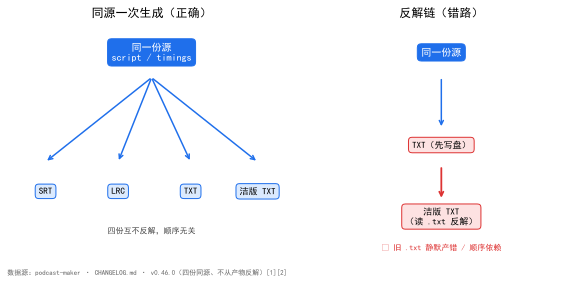

<!--
SPDX-License-Identifier: CC-BY-SA-4.0
Copyright (c) 2026 wUwproject
Licensed under Creative Commons Attribution-ShareAlike 4.0 International (CC BY-SA 4.0).
See https://creativecommons.org/licenses/by-sa/4.0/ for details.
-->

# 第五部 · 30｜字幕四份同源：为什么我不从产物反解

> 摘要：一期出片从三份字幕扩到四份，第四份是摘掉时间戳方括号的洁版 TXT。关键不在「多一份」，而在四份由同一份源同一次生成、互不反解。本文只讲这一个矛盾：多份产物一旦互相反解，就埋下顺序依赖与陈旧数据的雷。

## 一、引子：真实起点

有用户要把字幕喂给外部工具：逐行读取、复制粘贴、再处理。可磁盘上的字幕长这样：

```text
[00:03]小美：欢迎收听《我思故我写系列播客》…
```

方括号 `[]` 是给解析器的定界符，对人阅读、对外部工具就是两层噪声。于是需求来了：给一份「干净」的、摘掉方括号的字幕。

直觉答案很诱人——读磁盘上那份 `.txt`，把方括号拿掉，不就完了？

## 二、现象：它到底长什么样

v0.46.0 把一期出片从三份字幕扩到**四份**，第四份是整秒 TXT 摘掉时间戳方括号的版本 `{期号}_clean.txt` [1]：

```text
整秒 TXT    [00:03]小美：欢迎收听《我思故我写系列播客》…
洁版 TXT     00:03小美：欢迎收听《我思故我写系列播客》…
```

四份由**同一份源、同一次生成**，`srt` / `lrc` / `txt` 三份**逐字节不变** [1]。洁版摘掉方括号后，时间戳仍是定宽一列、与正文之间不留分隔（`00:03小美：…`），列照旧对齐，又少两个字符 [1]——既干净，又不破坏排版对齐。

四份产物逐项对照如下：

| 产物 | 时间戳写法 | 方括号 | 列对齐 | 生成方式 | 与源关系 |
|---|---|---|---|---|---|
| SRT | `[00:03]` | 有 | — | 同源一次生成 | 逐字节一致 [1] |
| LRC | `[00:03]` | 有 | — | 同源一次生成 | 逐字节一致 [1] |
| TXT（整秒） | `[00:03]` | 有 | 定宽 | 同源一次生成 | 逐字节一致 [1] |
| 洁版 TXT | `00:03`（无括号） | 无 | 定宽、与正文不留隔 | 同源一次生成（关 `bracket`） | 与 TXT 差 2 字符/行 [1] |

## 三、错误尝试：我们怎么绕弯的

绕弯的那条路，就是开头那个诱人直觉：**读磁盘上那份 `.txt`，把方括号摘掉**。

这条错路有两个隐性代价，当时没立刻炸，但都是雷：

**隐含依赖「txt 必须先存在」。** 洁版若去读磁盘上的 `.txt`，就等于声明「生成洁版之前，普通 txt 已经写好」。两份产物从此有了先后顺序——而这份顺序本不该存在。

**陈旧数据静默产错。** 目录里若躺着上一期的旧 `.txt`（批任务常见），洁版会安静地读那份旧的、拿掉括号，产出一份「看起来对、实则错」的内容，没有任何报错 [2]。这是最糟的一类 bug：不红、不崩，只是悄悄错。

## 四、根因：为什么

根因一句话：**反解破坏同源律**。

> **同源律**：多份产物由同一数据源一次生成、不互相反解，避免漂移。

四份字幕（SRT / LRC / TXT / 洁版 TXT）本该都从同一份 `script` / `timings` 现生成。一旦洁版去「读另一份产物再加工」，四份就不再是同源——它们变成了「源 + 衍生物」的链条。链条上任一环陈旧、缺失、顺序错，下游就静默出错（见第三节）。反解是隐式依赖与陈旧数据的温床，本质是让产物互为输入。

  
*图 1：同源一次生成（左）与反解链（右）结构对比。数据源 [1][2]。左：四份都从同一份源现生成、互不反解、顺序无关；右：洁版去读磁盘 `.txt` 反解，引入「旧文件静默产错」与「依赖 txt 先存在」两个雷。*

## 五、正确修法：怎么做对的

四份同源、一次生成，不互反解。

**`subtitle_engine.build_clean_txt()`** 是洁版产物，与 `build_txt` 共用 `_build_lyrics` 与同一个 `fmt_second_time`——**不是**读磁盘 `.txt` 再拿括号 [3]。

**`_build_lyrics(..., bracket=True)`** 共用主体多一个「时间戳带不带方括号」的形参 [3]。`fmt` 管精度、`bracket` 管方括号，三份歌词产物因此仍是**一套清理、一条路径**（取起始时间、一行一条、句内换行压空格、说话人判据同源），只是时间戳写法不同。洁版 = 把 `bracket` 关掉，其余一字不差。

**落点接进既有结构**：`layout.episode_files()["subtitle_clean_txt"]` → `字幕/{期号}_clean.txt`；前三份同前缀，洁版在前缀后加 `_clean`，按期号一列仍能把同一期四份捞齐 [3]。**`pipeline` 第 6 步**写第四份，进 `result`、进 manifest 的 `assets`，产物区多一行「字幕（洁版 TXT）」[3]。

**不猜规则**：摘方括号的写法照原样搬进来，一个字没发挥 [2]——洁版不是「重新理解」字幕，只是同源输出的另一种写法。

### 5.1 `fmt_second_time`：银行家舍入的陷阱与修法

时间戳取整是四份同源最容易漂开的地方。整秒 TXT 用 `mm:ss`，LRC 用 `mm:ss.xx`——两者四舍五入必须落到同一秒，否则同一句在两份产物里差一秒，行对照时错位。

坑在 Python 的 `round` 是**银行家舍入**：`round(2.5)` 得 2。但 `[00:02.50]` 按日常「四舍五入」必须进到第 3 秒。直接写 `round(seconds)` 会让 `.50` 这一档悄然后退，LRC 与 TXT 各走各的进位规则，同源律在此破功（`podcast_maker/subtitle_engine.py:267`，设计说明见 `podcast-maker · CHANGELOG.md · v0.44.0 · 新增：一期三份字幕`）：

```python
def fmt_second_time(seconds):
    """整秒 TXT 用的 `mm:ss`——LRC 的 `mm:ss.xx` 四舍五入到秒，别处同口径。

    **不写成 `round(seconds)`**：Python 的 `round` 是银行家舍入，`round(2.5)` 得 2，
    而 `[00:02.50]` 按「四舍五入」必须进到第 3 秒。走整数半加：先量化到**与
    `fmt_lrc_time` 同一颗百分秒**，再 `+50 // 100` —— 两条路落在同一根数轴上，
    不会一条进位一条不进（`tests/test_subtitle_txt.py` 锁这条同源律）。
    """
    seconds = max(0.0, float(seconds))
    total = (int(round(seconds * 100)) + 50) // 100
    return "%02d:%02d" % (total // 60, total % 60)
```

关键在 `+50 // 100`：先把秒量化到与 LRC **同一颗百分秒**（`int(round(seconds * 100))`），再整数半加进位。LRC 与整秒 TXT 共用这颗百分秒，两条路因此落在同一根数轴上——`tests/test_subtitle_txt.py` 用「把 LRC 交给离线取整工具，结果须与 `build_txt` 逐字节相同」钉死这条同源律。

### 5.2 `_build_lyrics`：共用主体长什么样

四份歌词产物（LRC / 整秒 TXT / 洁版 TXT，加 SRT 同源时间轴）不是四套生成逻辑，而是一条主体三个开关。真实实现（`podcast_maker/subtitle_engine.py:341`）：

```python
def _build_lyrics(script, cfg, timings, fmt, bracket=True):
    """歌词类产物的共用主体——LRC、整秒 TXT、洁版 TXT 只差时间戳怎么写。

    同一条歌词不该有三条生成路径：它们取同一份 script、同一份 timings、同一个
    说话人判据（`speaker_name_shown`）、同一套「一条一行」清理（句内换行换成空格，
    否则一条歌词被劈成两条、只剩第一条带时间戳）。只把**时间戳怎么写**当参数传
    进来——`fmt` 管精度，`bracket` 管要不要方括号（只有洁版不要）。「同一份源」
    因此是代码级的事实，而不是三处各写一遍、等着哪天漂开。
    """
    show_name = speaker_name_shown(cfg)
    out = []
    for i, item in enumerate(script):
        t = timings[i] if i < len(timings) else {"start": 0.0, "end": 0.0}
        # 一条一行：句内的换行会把一条歌词劈成两条，只剩第一条带着时间戳
        one_line = dict(item)
        one_line["text"] = (str(item.get("text", ""))
                            .replace("\r", " ").replace("\n", " "))
        stamp = fmt(t["start"])
        body = _caption_text(cfg, one_line, show_name)
        out.append("[%s]%s" % (stamp, body) if bracket
                   else "%s%s" % (stamp, body))
    return "\n".join(out)
```

「同一份源」落实在四处：取同一份 `script`、同一份 `timings`、同一个 `speaker_name_shown` 判据、同一套句内换行压空格清理。三份歌词产物只是 `fmt`（精度）与 `bracket`（方括号）两个形参不同——洁版 = `fmt_second_time` + `bracket=False`，其余一字不差。

### 5.3 演进：从两处各写一遍到共用主体

`_build_lyrics` 不是一开始就有的。早先 LRC 与整秒 TXT 各自内联时间戳写法，共用逻辑散在两边，迟早各说各话。重构前的 LRC 片段（两处各写一遍 `fmt_lrc_time`、各自处理「句内换行压空格」）：

```python
def build_lrc(script, cfg, timings):
    show_name = speaker_name_shown(cfg)
    out = []
    for i, item in enumerate(script):
        t = timings[i] if i < len(timings) else {"start": 0.0, "end": 0.0}
        one_line = dict(item)
        one_line["text"] = (str(item.get("text", ""))
                            .replace("\r", " ").replace("\n", " "))
        out.append("[%s]%s" % (fmt_lrc_time(t["start"]),
                               _caption_text(cfg, one_line, show_name)))
    return "\n".join(out)
```

重构后抽出 `_build_lyrics`，LRC / TXT / 洁版三份只差 `fmt` 与 `bracket`：

```python
def build_lrc(script, cfg, timings):
    return _build_lyrics(script, cfg, timings, fmt_lrc_time)

def build_txt(script, cfg, timings):
    return _build_lyrics(script, cfg, timings, fmt_second_time)

def build_clean_txt(script, cfg, timings):
    return _build_lyrics(script, cfg, timings, fmt_second_time, bracket=False)
```

三份因此回到「同一份源、一次生成」——`tests/test_subtitle_txt.py` 锁的同源律（整秒 TXT 交给离线取整工具转出来，须与 LRC 逐字节相同）才有代码级依托（设计说明见 `podcast-maker · CHANGELOG.md · v0.44.0 · 新增：一期三份字幕`；`build_clean_txt` 复用见 `podcast-maker · CHANGELOG.md · v0.46.0 · 新增：出片字幕第四份`）。

## 六、验证：数据说话

四组证据，测量条件一并给出。

### 实验设计：14 对字节复现探针

**目的**：验证「洁版不从磁盘 `.txt` 反解」这一承诺——即 `build_clean_txt` 的输出，与「把既有 `.txt` 反解成同一输入再走 `build_clean_txt`」的输出，逐字节一致。

**输入**：磁盘上 14 份既有 `_clean.txt` 及其对应的 `.txt`。

**步骤**：只读探针把每份 `.txt` 反向解析成 `build_clean_txt` 的输入 → 调用 `build_clean_txt` → 与磁盘既有 `_clean.txt` 逐字节比较 [4]（真实核对代码见 `tests/test_subtitle_txt.py`）。

**观测**：14 对输出，比对字节数。

**判定**：**14 对 / 0 不符** 即 PASS；任一不符即说明洁版仍隐含依赖某份既有产物，违反同源律 [4]。

**字节复现**（只读探针：磁盘 14 份 `.txt` 反解成输入 → `build_clean_txt` → 与既有 14 份 `_clean.txt` 比字节）[4]：**14 对 / 0 不符**，字节数逐份相同。

**前三份未动**（16 条快照核对）[4]：sha 一致。

**真路径集成**（真音频段时长 → 真时间轴 → 四份真写盘，15 项）[4]：全 PASS。

**单测**（全量 `python -m unittest discover`）[5]：新增 `tests/test_subtitle_txt.py::TestBuildCleanTxt`（8 项）；路径表从三份扩到四份并单列「洁版 = 前缀 + `_clean`」；其中一条用**逐字照抄**的正则写成独立实现，交叉验证 `build_clean_txt`——产品改了口径这条就响。全量单测 **1242 → 1251 OK**。

## 七、结语：一句话可复用结论

多份产物要同源一次生成，不互相反解。反解省的一行代码，换的是顺序依赖与陈旧数据两个雷——同源律照旧，代价最小。

### 引用与出处说明

| 编号 | 引用 | 出处 |
|------|------|------|
| [1] | 四份字幕同源；洁版摘方括号时间戳仍定宽对齐；srt/lrc/txt 逐字节不变 | podcast-maker · CHANGELOG.md · v0.46.0 · 条目「新增：出片字幕第四份——洁版 TXT」 |
| [2] | 不从产物反解；旧文件静默产错；不猜规则 | podcast-maker · CHANGELOG.md · v0.46.0 · 不做什么段 |
| [3] | `build_clean_txt` 共用 `_build_lyrics`/`fmt_second_time`；`_build_lyrics(bracket=True)`；`layout.episode_files["subtitle_clean_txt"]`；pipeline 第 6 步 | podcast-maker · CHANGELOG.md · v0.46.0 · 新增段<br>`podcast_maker/subtitle_engine.py:build_clean_txt` / `_build_lyrics` |
| [4] | 14 对/0 不符；sha 一致；15 项全 PASS | podcast-maker · CHANGELOG.md · v0.46.0 · 验证段<br>`tests/test_subtitle_txt.py`（逐字节复现 / 同源律锁） |
| [5] | 单测 1242→1251；TestBuildCleanTxt 8 项；逐字照抄正则交叉验证 | podcast-maker · CHANGELOG.md · v0.46.0 · 测试段<br>`tests/test_subtitle_txt.py` |
| [6] | `fmt_second_time` 银行家舍入陷阱；`+50 // 100` 整数半加共用百分秒；LRC/TXT 同源律 | podcast-maker · CHANGELOG.md · v0.44.0 · 新增：一期三份字幕——SRT / LRC / 整秒 TXT 由同一份源生成<br>`podcast_maker/subtitle_engine.py:fmt_second_time` |

## 延伸阅读

- **同书其他篇**：#1《进度条永远卡在 0% 和 100%》的 `_BANDS` 是「账本」维度的同源——进度只从一张表派生；本篇是「产物」维度的同源——多份字幕只从一份源生成。两条同源律同构。

---

*最后更新：2026-10-08（已补丰富化：四份对照表 + 同源树/反解链图 + 探针实验设计；四检：真实性 PASS / 底层逻辑 PASS / 空推论 PASS / 循环论证 PASS）*
