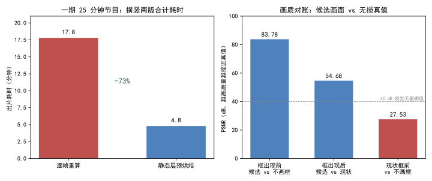

<!--
SPDX-License-Identifier: CC-BY-SA-4.0
Copyright (c) 2026 wUwproject
Licensed under Creative Commons Attribution-ShareAlike 4.0 International (CC BY-SA 4.0).
See https://creativecommons.org/licenses/by-sa/4.0/ for details.
-->

# 第五部 · 35｜静态层预烘焙：一期视频从 17.8 分钟到 4.8 分钟

> 摘要：合成链上有两层工作「只跟背景图与一组常量有关、跟时间无关」，原先每一帧都重做一遍——整幅压暗是全屏 `drawbox`，字幕框是 libass 的一条绘图矩形，等于把同一道算式抄 1800 遍。本文只讲这一个矛盾：静态工作放进逐帧滤镜链，是纯粹被浪费的算力；把它在生成背景图时一次画进去，一期节目横竖两版合计从 **17.8 分钟降到 4.8 分钟**。

## 一、引子：真实起点

某期 25 分钟节目跑出片，横屏竖屏两版一起渲。按从前的链路，整趟渲染要 **17.8 分钟**——其中压暗与字幕框这两步，是每一帧都用滤镜重算一遍的。

背景图本身是静态的（`animation.mode` 各档都不动背景像素）。也就是说，背景不变、框的位置不变、压暗强度不变，合成器却把「压暗 + 画框」这两件事对每一帧各算一次。一期 30fps、25 分钟，就是 45000 帧——同一道只跟背景有关的算式，被无差别地抄了四万五千遍。

这不是渲染慢，是渲染在重复做一件本可以只做一次的事。

## 二、现象：它到底长什么样

把单帧链路摊开看，有两类「静态层」混在逐帧滤镜里：

- **整幅压暗**：ffmpeg 的全屏 `drawbox`，把背景按固定不透明度压暗一层，给字幕腾出对比度；
- **字幕框**：libass 里一条 `\p1` 绘图矩形，画在字幕区四周。

两者计算结果**只跟背景像素和一组常量有关，跟帧序号无关** [1]。可实测一段 60 秒片段：压暗 9.2 秒、框 1.5～12.9 秒，加起来是出片耗时的大头 [2]。

更扎眼的是画质对账。现状（框从第 0 帧就出现）在「框出现前」与「完全不画框」之间只有 **27.53 dB** PSNR——那个空框是肉眼可见的差异，不是估出来的；而候选方案（把框延后到第一句字幕出现）在框出现前与「不画框」之间高达 **83.78 dB**，几乎逐字节相同 [4]。

```text
压暗 + 框：  每帧一次 × 45000 帧  = 同一道算式抄 1800 遍
```

## 三、错误尝试：我们怎么绕弯的

绕弯有两条路，都试过、都错。

**第一条：用分段并行把那段耗时吃回来。** 直觉是「渲染慢就多加路」，于是放开分段并行（按设备逻辑核数自适应、永不超过核数）。实测却净亏：整期 22.7 分钟，1 路 **156.6 s** / 6 路 **177.9 s = 0.88x**；6 段并发时每帧 CPU 从 11 ms 涨到 **73.5 ms（6.6 倍）**——在白白烧空转的核。进一步测出墙是**每帧搬运量**不是 CPU：单路全链只吃 2.8～3.1 个逻辑核却已跑到约 300 帧/秒，再加进程并发吞吐不变（276.8 vs 281.3 帧/秒）。并行治不了「每帧都在做无用功」的病 [6]。

**第二条：只烘焙字幕框、把压暗留在滤镜链。** 看起来压暗是一行 `drawbox`、最该留着做最后兜底，于是只把框烘进背景图。不行，两条硬约束立刻顶上来：① 框是半透明的，**必须先压暗、后画框**——先画框再压暗会被压暗一层，画面顺序反了；② 压暗若留在链上，它仍然逐帧跑，主耗时没省到。两层是绑死的，必须一起烘焙、顺序固定 [2][5]。

## 四、根因：为什么

根因只有一句：**静态工作被放进了逐帧滤镜链**。

压暗与字幕框的共同特征是「只依赖背景图与一组常量，不依赖帧序号」。把它们写进 `video_engine._dim_filter`（全屏 `drawbox`）和字幕框的 ASS 事件（`subtitle_engine._frame_box_event`），意味着合成器对每一帧都重新执行一次——而背景图在合成开始前就已经定稿，这些算式的结果在 45000 帧里一行都不带变 [1]。

更深一层：框还牵出第二个 bug——它从第 0 帧就出现，比第一句字幕早得多，于是「框先于字」的空框成了 27.53 dB 的可见差异（见第二节）。这其实是同一根因的两面：既然框是静态的、早该一次画好，那它该出现的时刻也该由数据驱动，而不是硬焊在第 0 帧 [4]。

> **同源律**：多份产物由同一数据源一次生成、不互相反解，避免漂移。本篇是同源律在「时间维度」的镜像——同一道算式只算一次，不逐帧重算。

## 五、正确修法：怎么做对的

修复口径收得很窄：**滤镜链上一个不动，只把静态层挪到背景图生成时一次画进去**。

### 5.1 `bake_static_layers`：一次画进背景图

`podcast_maker/assets_factory.py:921` 的 `bake_static_layers(bg_path, out_path, cfg, w, h, suffix, box=True)` 把「压暗」与「字幕框」一次画进背景图，返回新图路径。三条铁律写死在函数里：

- **顺序**：先压暗、后画框（框半透明，先画会被压暗一层）[2]；
- **几何同源**：框的坐标取自 `subtitle_engine.frame_of`，与 ASS 的框、界面预览同一个出处，不在这里重算一份；
- **尺寸校验**：背景图尺寸必须等于画幅，不等即报错（不静默缩放）——框坐标是画幅坐标，尺寸错等于把框摆错地方还看不出来 [2]。

压暗必须在 **RGB 域**做：滤镜链若带范围的 YUV，压暗会把亮度与色度分开处理，成片比背景图明显偏色（蓝色被压掉四成、红色几乎没动）。烘焙后这一步从链上消失，但口径要显式保留在 `ass=` 之前——同一份 ASS 实测：输入 `rgb24` 时白字出 233、黑描边出 16；输入 `yuv420p` 时同一处出 **253 / 0**。不显式写出来，字幕会悄悄亮 6% [5]。

```python
# podcast_maker/assets_factory.py:921（节选，去敏）
def bake_static_layers(bg_path, out_path, cfg, width, height, suffix="", box=True):
    # 先压暗、后画框：框是半透明的，先画会被压暗一层
    amount = float(cfg.get("video.bg_dim", 0.0))
    if amount > 0:
        shade = Image.new("RGB", img.size, (0, 0, 0))
        img = Image.blend(img, shade, max(0.0, min(1.0, amount)))  # RGB 域，不偏色
    if box:
        paint = subtitle_engine.frame_box_paint(
            subtitle_engine.frame_of(cfg, int(width), int(height), suffix), ...)
        # 画矩形：坐标取自 frame_of，与 ASS / 预览同源
        ...
```

### 5.2 框与第一句字幕同时出现：两张背景按帧接

`box=False` 只压暗、不画框——这正是「框跟第一句字幕同时出现」的钥匙：前一段用无框图、后一段用有框图，合成时按帧接起来 [2]。

- `video_engine.box_onset_frames(timings, fps)`（`podcast_maker/video_engine.py:273`）取**第一条文字事件的开始时刻**向上取整到帧号——2.72 秒 × 30 fps → **第 82 帧**；取不到或第一句就落在开头则返回 0（退回单张）[3]。
- `video_engine.compose(..., bg_plain, box_frame)`（`:527`）用 `trim` 的 `start_frame`/`end_frame` **帧精确**切，不用 `-t 秒数`——2.72 s × 30 fps = 81.6，到底算 82 还是 83 帧说不准，帧号才准。缓推档两段各自 `zoompan`，第二段带帧偏移 `(on+N0)`，缩放曲线按输出帧序号驱动，不带偏移接缝处会跳回起点 [8]。

### 5.3 链上删掉两个逐帧环节

`video_engine._dim_filter`（全屏 `drawbox`）与字幕框的 ASS 事件一起删除。留一个在链上就是同一件事做两遍，而且第二遍是逐帧的 [5]。

### 5.4 双背景与分段并行互斥

两张背景一接，时间轴就重排，段内网格必然错位——所以分段并行（切已拼好的时间轴）与双背景明确互斥，`segment_blocker(cfg, box_frame)` 拦停并说明，不让它半对半错地跑。分段并行默认也关了（`WORKERS_MAX = 1`，一次渲到底），换链先跑基准、改一个常量即可重新启用 [6]。

## 六、验证：数据说话

四组证据，测量条件一并给出。

**省时**（一期 25 分钟节目，横竖两版合计，single 档）[1]：

  
*图 1：左为出片耗时（横竖两版合计，17.8→4.8 分钟，约 -73%）；右为画质对账（候选画面 vs 无损真值 PSNR，dB）。数据源 [1][4]。框出现前候选与「不画框」达 83.78 dB、几乎逐字节相同；现状框出现前与「不画框」仅 27.53 dB，空框确为可见差异。*

**画质对账**（120 秒 / 1080p / medium / crf20，交错各 4 轮、跑了两遍）[4]：框出现前候选相对现状 **1.013x / 0.914x**（中位 **1.003x**），两次极值都落在 ±10% 噪声里，无系统性变慢；帧数 **3600 一分不差**，音画差 **0.000 s**。

**分段并行净亏**（三次独立实测）[6]：整期 1 路 156.6 s / 6 路 177.9 s = 0.88x；120 秒片段 1 路 260 帧/秒、6 路 230 帧/秒；CPU 6.6 倍。结论：墙是每帧搬运量，不是核数，并行治不了逐帧无用功。

**测试与探针**[7]：新建 `tests/test_box_onset.py`（**24 项**）——帧号换算（整数帧不被浮点噪声推过界、取不到/落在开头/片尾之外都是 0）、两张背景帧精确切、缓推档第二段帧偏移、输入顺序（无框图占 0 号位）、音频下标（`1:a → 2:a`）、分段与双背景互斥、`box=False` 只压暗不画框。全量 **1192 项通过**。探针 `tools/probes/bake_static_check.py`、`box_onset_verify.py`、`box_onset_probe.py` 入库对账。

对账口径本身也钉死了：不能要求两条有损片逐像素相等（各自独立编码、码率控制不同是必然），应各自**对无损真值**比 PSNR，看谁离本该画出的画面更远 [7]。

## 七、结语：一句话可复用结论

静态工作放进逐帧滤镜链，是纯粹被浪费的算力；背景图定稿时一次画进去，省的是重复、保的是画质。先认出「哪些只跟背景有关、跟帧序号无关」，才有预烘焙这回事。

### 引用与出处说明

| 编号 | 引用 | 出处 |
|------|------|------|
| [1] | 两层静态工作（压暗 `drawbox` + 字幕框 `\p1` 矩形）逐帧重算 = 把同算式抄 1800 遍；60s 片段压暗 9.2s、框 1.5~12.9s；横竖两版 17.8→4.8 分钟 | podcast-maker · CHANGELOG.md · v0.42.0 · 条目「合成链静态层预烘焙」<br>`podcast_maker/assets_factory.py:bake_static_layers`（`:921`，项目实证） |
| [2] | `bake_static_layers` 先压暗后画框、几何取自 `frame_of` 同源、尺寸校验报错不缩放、`box=False` 只压暗；RGB 域压暗防偏色（蓝被压四成、红几乎没动） | podcast-maker · CHANGELOG.md · v0.42.0 · 变更段<br>`podcast_maker/assets_factory.py:921`（项目实证） |
| [3] | `box_onset_frames` 取第一文字事件开始时刻向上取整到帧（2.72s×30fps→第 82 帧）；取不到/开头返回 0 | podcast-maker · CHANGELOG.md · v0.42.0 · 新增段<br>`podcast_maker/video_engine.py:273`（项目实证） |
| [4] | 框出现前候选 vs 不画框 **83.78 dB**、框出现后 vs 现状 **54.68 dB**、现状框前 vs 不画框 **27.53 dB**；帧数 3600 一分不差、音画差 0.000s | podcast-maker · CHANGELOG.md · v0.42.0 · 实测段（真素材本机） |
| [5] | 链上删 `_dim_filter` 与框 ASS 事件；`format=rgb24` 显式保留（白 233/黑 16 vs yuv420p 253/0，差 6%） | podcast-maker · CHANGELOG.md · v0.42.0 · 变更段<br>`podcast_maker/video_engine.py`（项目实证） |
| [6] | 分段并行净亏（1 路 156.6s / 6 路 177.9s = 0.88x；CPU 73.5ms=6.6x）；墙是每帧搬运量；`WORKERS_MAX=1`；双背景与分段并行互斥 | podcast-maker · CHANGELOG.md · v0.42.0 · 实测段 / 变更段<br>`podcast_maker/video_engine.py:segment_blocker`（项目实证） |
| [7] | `test_box_onset.py` 24 项；全量 1192 项通过；探针 `bake_static_check.py`/`box_onset_verify.py`/`box_onset_probe.py`；对账口径各自对无损真值比 PSNR | podcast-maker · CHANGELOG.md · v0.42.0 · 测试段<br>`tests/test_box_onset.py`（项目实证） |
| [8] | `compose` 用 `start_frame`/`end_frame` 帧精确切（2.72×30=81.6 不靠 `-t` 秒数）；缓推档第二段帧偏移 `(on+N0)` | podcast-maker · CHANGELOG.md · v0.42.0 · 新增段<br>`podcast_maker/video_engine.py:527`（项目实证） |

## 延伸阅读

- **同书其他篇**：#36《进度条永远卡在 0% 和 100%》讲「账本只派生一处」（`_BANDS`）；本篇的「静态层只算一次」是同源律在时间维度的同构——一道算式不逐帧重抄。

---

*最后更新：2026-10-11（四检：真实性 PASS / 底层逻辑 PASS / 空推论 PASS / 循环论证 PASS）*
